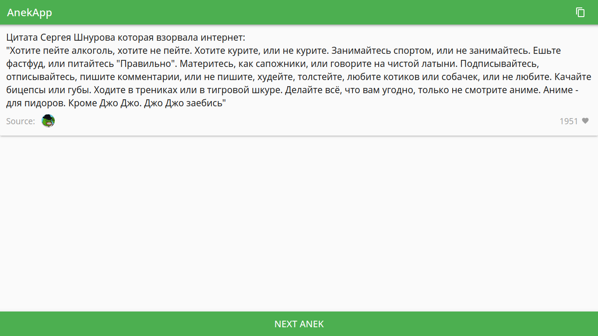
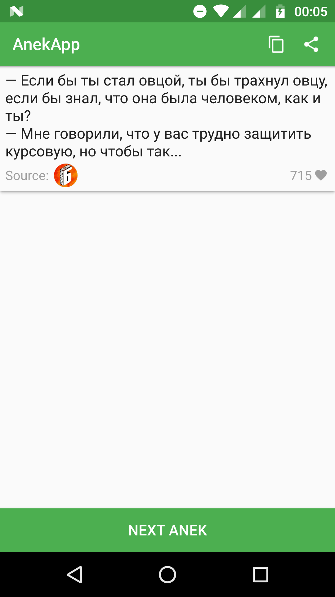

# AnekApp

Simple cross-platform material design app for reading random anecdotes. 

Written in C++/Qt5 (QML). Depends on [androidutils](https://github.com/vasyukvv42/androidutils) library.
Icons used are from the [Google's Material icon set](https://github.com/google/material-design-icons).

## Screenshots

Desktop:

Android:
